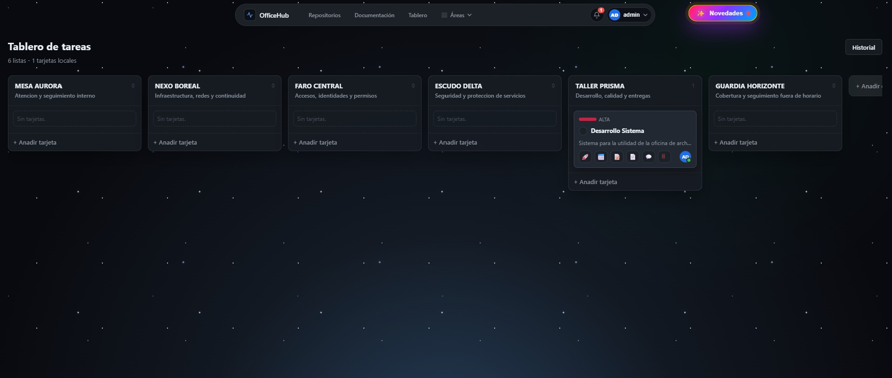
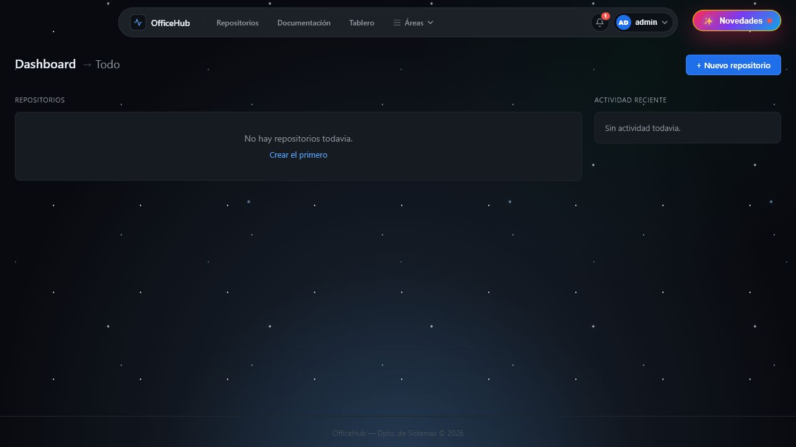
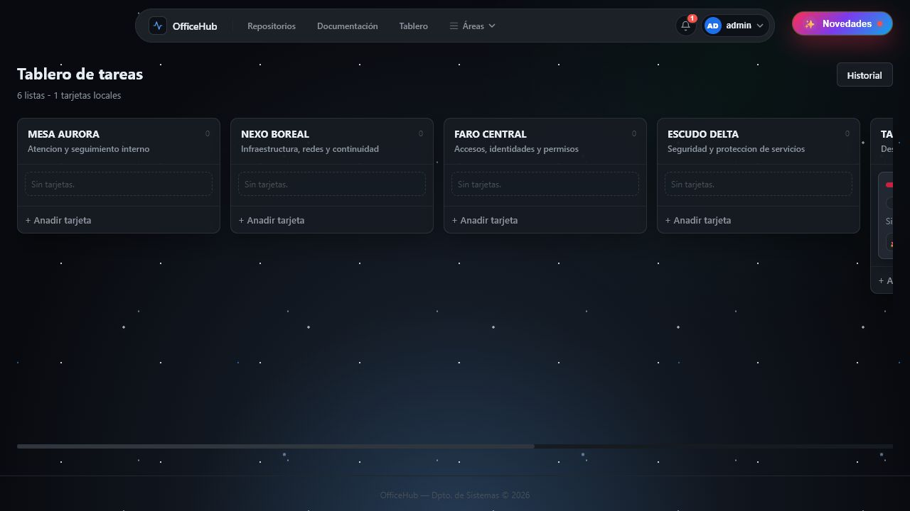
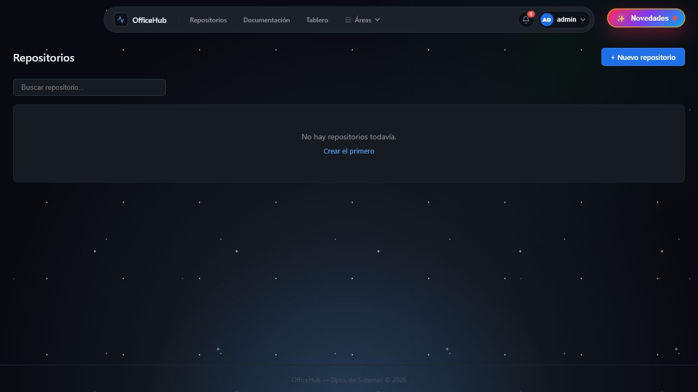
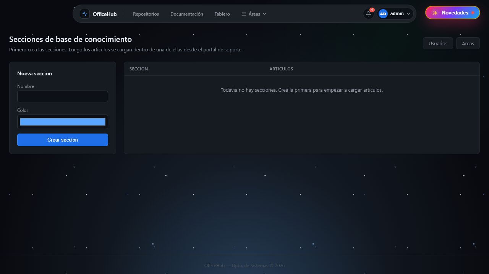

<div align="center">

# OfficeHub

### Plataforma interna para equipos de tecnología

Gestión centralizada de documentación, incidencias, repositorios, tareas y colaboración técnica.

<br>



<br>


</div>

---

## Sobre el proyecto

**OfficeHub** es una plataforma web diseñada para centralizar distintas tareas habituales de una oficina de sistemas.

El proyecto reúne en una misma aplicación la gestión de documentación técnica, incidencias, tableros de trabajo, usuarios, permisos y repositorios.

Esta versión fue preparada especialmente como muestra de portfolio. Conserva componentes representativos de la arquitectura, la interfaz y la lógica general, pero algunas integraciones y reglas avanzadas fueron simplificadas para proteger la implementación completa del producto.

---

## El problema

En los equipos de tecnología, la información suele quedar distribuida entre documentos, mensajes, tableros y herramientas independientes.

Esto puede provocar:

- documentación difícil de encontrar;
- poca trazabilidad de los cambios;
- tareas dispersas;
- problemas para compartir procedimientos;
- dificultad para conocer el estado de cada proyecto;
- dependencia de varias plataformas externas.

OfficeHub propone reunir estos procesos en un único entorno organizado.

---

## Funcionalidades principales

### Documentación técnica

- Creación y edición de artículos.
- Organización mediante categorías.
- Archivos adjuntos.
- Búsqueda de procedimientos.
- Control administrativo del contenido.

### Gestión de incidencias

- Registro de solicitudes y problemas.
- Seguimiento del estado.
- Comentarios y archivos adjuntos.
- Organización por categorías.

### Tablero Kanban

- Listas y tarjetas de trabajo.
- Comentarios y responsables.
- Historial de tareas completadas.
- Adjuntos y trazabilidad.

### Repositorios y colaboración

- Catálogo centralizado de repositorios.
- Gestión de permisos.
- Visualización de archivos y commits.
- Flujo demostrativo de pull requests.
- Guías para trabajar con Git.

### Administración

- Gestión de usuarios.
- Áreas y roles.
- Permisos de acceso.
- Registro de actividad.
- Notificaciones internas.

---

## Capturas

### Panel principal



### Documentación


### Tablero de trabajo



### Repositorios



### Soporte e incidencias



---

## Tecnologías

| Capa                 | Tecnología             |
| -------------------- | ---------------------- |
| Backend              | PHP 8                  |
| Frontend             | HTML, CSS y JavaScript |
| Base de datos        | MySQL                  |
| Servidor local       | Apache / XAMPP         |
| Arquitectura         | MVC personalizado      |
| Persistencia         | PDO                    |
| Control de versiones | Git                    |

---

## Arquitectura

El proyecto utiliza una arquitectura MVC construida sin frameworks externos.

```text
officehub-portfolio/
├── config/             # Configuración de la aplicación
├── public/             # Punto de entrada y recursos públicos
├── sql/                # Esquema demostrativo de base de datos
├── src/
│   ├── Controllers/    # Controladores
│   ├── Core/           # Router, base de datos, sesiones y vistas
│   ├── Models/         # Acceso y representación de datos
│   ├── Services/       # Servicios e integraciones demostrativas
│   └── Views/          # Interfaz de usuario
└── storage/            # Archivos generados por la aplicación
```
